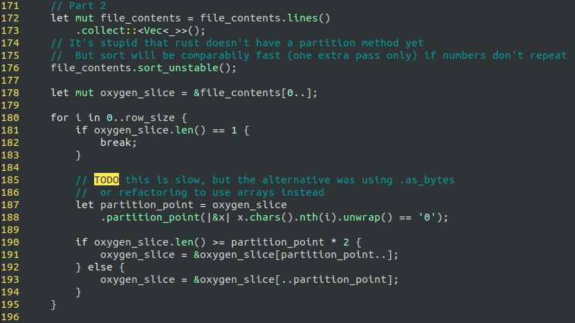

As some might already know, every year on Christmas time there is the [Advent of Code](adventofcode.com), 
which `"... is an Advent calendar of small programming puzzles for a variety of skill 
sets and skill levels that can be solved in any programming language you like"`. From December 1st 
until the 25th they release one programming challenge per day (each challenge consisting of 2 parts) 
that can be solved in the language of your choice. It's a great opportunity to learn something new 
through problems, because the challenges are not so easy that you would get bored, but also not so 
hard that you would get demotivated in trying it with e.g. another programming language.

## A positive experience

Last year I wanted to lean VIM, so I decided that I would code all the solutions in Python using vim 
as my editor. Every day I would do some training in vim (e.g. following the vimtutor) or try to improve 
my `.vimrc` configuration a bit, then jump into solving the challenges. If I wrote something and realized 
that I could have done it more efficiently with a shortcut, I would undo and use the shortcut instead
(just for the sake of learning). The results turned out great, as I now use vim as my default editor 
and I felt a boost in my productivity.

## This year: Rust

Based on last year's positive experience, this year I decided to use the challenge to learn Rust. 
After some many years of Rust being chosen as the most loved programming language, I decided to check 
what the hype is all about, and whether it's justified. I come from a C++ and Python background, so 
I expect the language to be some sort of "C++ done right". My plan is to try to learn a bit of Rust 
every day (by following some tutorial) and then jump into the challenges

## Setup

The setup was quite chaotic and is the reason why now I'm behind the challenge. I have never had any 
contact with the language, so on day 1 I had to start from the very basics, like trying to find a good 
rust tutorial and set up my dev environment. I also followed the 
[book](https://doc.rust-lang.org/book/title-page.html) to get a first understanding of the language.
This should have planned better and done this first steps ahead of time.

 <b> Days 01 - 03 </b> 

## Days 01 - 03

Because of the "technical problems" at the beginning, I lagged behind at the challenge, so that I 
ended up solving days 01 to 04 in a single day. Throughout the challenge I tried to code as if I would 
do in a professional setting, leveraging the language features and making it flexible.
Because of that, the solutions would take me a bit longer as I didn't want to just brute-force the approach
with a dummy for-loop and move on to the next task.

Right now, the code is organized in a single file, that contains 4 functions, one for each day and 2 
general functions read the input files respectively. The plan is to split this file in the future, but I want
to first learn about modules and classes to do it right.

### Slices 
Slices (equivalent of ranges in C++20) are a killer feature and simplified my code by a lot. 
Take as example part 2 of Day 03: 

This was very elegantly solved by sorting the contents and constantly finding the split points 
for each bit. The slice would be updated according to the rules of the game. To achieve the same in C++, 
you need to keep a pair of iterators. It could be even better (more efficient) if Rust had an in-place 
`partition` method and an `O(1)` method to access characters in strings (see [General Impressions](#general-impressions)).

## General impressions

This list will change as I discover and understand more about the language.

- So far, if there is any big advantage of Rust compare to C++, it's `Cargo`. One could argue that
  all memory safety guarantees that Rust provides can be achieved with idiomatic, modern C++. But compiling
  and managing dependencies in C++ is just horrible.
- Rust has a very nice syntax that feels more modern than C++. I particularly like the iterators interface, 
  with functionalities such as `map`, `zip` and `enumerate`. It feels like a marriage between Python and C++.
- The exception handling part is very annoying when you just want to write some quick code, but I 
  understand its value as it reminds you to consider all possible exceptions.
- Coming from C++, I expected that I would easily understand Rust's ownership and borrowing rules, but they 
  are harder than I thought. Often I had to wrestle with the compiler to get it right.
- I have the impression that Rust's path library missed on the chance of imitating pathlib in Python 
  and overloading the `/` operator to join a path and a string.
- When solving the challenges of Day 3, I was very annoyed by the fact that Rust doesn't have an in-place
  `partition` method similar to `std::partition` (it's experimental now). I wonder why this method wasn't 
  added from the beginning. I might be wrong, but my feeling is that C++'s STL design is much better 
  thought-of. Especially if one considers that Rust had the chance to learn with the experience of other languages.
- The possibility to re-use variable names is very neat and helps me cope with the language's ownership 
  model. Initially, I thought that this would be a source of bugs, but I ended up using it quite extensively.
- Inclusive indexes `[..=idx]` are awesome and should be supported by other languages.
- Manipulating strings (specially getting the n-th char), was extremely frustrating. But it's positive 
  that Rust supports UTF-8 strings out-of-the-box. 
- I really like that it supports labels to break of an outer loop, it's a nice syntactic sugar.
